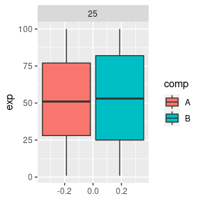
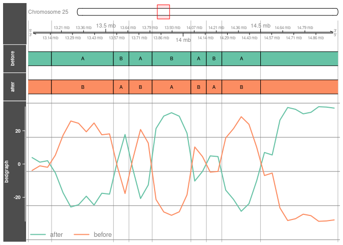

- <a href="#1-tadkit" id="toc-1-tadkit">1 TADkit</a>
  - <a href="#11-installation" id="toc-11-installation">1.1 Installation</a>
- <a href="#2-data-format" id="toc-2-data-format">2 Data format</a>
  - <a href="#21-matrix" id="toc-21-matrix">2.1 matrix</a>
  - <a href="#22-bed" id="toc-22-bed">2.2 .bed</a>
  - <a href="#23-bedgraph" id="toc-23-bedgraph">2.3 .bedgraph</a>
  - <a href="#24-bigwig" id="toc-24-bigwig">2.4 .bigwig</a>
- <a href="#3-domains-plot" id="toc-3-domains-plot">3 Domains plot</a>
  - <a href="#31-tadplot" id="toc-31-tadplot">3.1 TADplot</a>
  - <a href="#32-mtadplot" id="toc-32-mtadplot">3.2 mTADplot</a>
  - <a href="#33-options" id="toc-33-options">3.3 Options</a>
- <a href="#4-matrix-plot" id="toc-4-matrix-plot">4 Matrix plot</a>
  - <a href="#41-matplot" id="toc-41-matplot">4.1 MATplot</a>
  - <a href="#42-mmatplot" id="toc-42-mmatplot">4.2 mMATplot</a>
- <a href="#5-analysis" id="toc-5-analysis">5 Analysis</a>
  - <a href="#51-around-boundaries" id="toc-51-around-boundaries">5.1 Around
    boundaries</a>
  - <a href="#52-within-domains" id="toc-52-within-domains">5.2 Within
    domains</a>
- <a href="#6-compartment-calling-and-orientation"
  id="toc-6-compartment-calling-and-orientation">6 Compartment calling and
  orientation</a>
- <a href="#7-clear-files" id="toc-7-clear-files">7 Clear files</a>

<!-- README.md is generated from README.Rmd. Please edit that file -->

# 1 TADkit

The TADkit package has 2 objectives. The first one is to facilitate
visualizations of HiC matrices and the data that are generally
associated. To this end, two pairs of functions (based on gviz and
ggplot packages) have been created to visualize :

- domains such as TADs (topological Associated Domain) or compartments
  (compartment A and B),
- interaction matrices.

The second objective of the package is to allow distribution analysis of
genomic annotations in the light of the 3D organisation.

## 1.1 Installation

You can install the development version of TADkit from
[GitHub](https://github.com/) with:

``` r
# install.packages("devtools")
devtools::install_github("Nico-FR/TADkit")
```

# 2 Data format

First, we will see the different types of data and their formats that
can be visualized with TADkit. Datas from 2 cows are available within
the package. Let’s start by loading the packages needed for that
tutorial.

``` r
library(TADkit)
library(dplyr)
library(GenomicRanges)
library(GenomicFeatures)
library(ggplot2)
library(rtracklayer)
library(TxDb.Btaurus.UCSC.bosTau9.refGene)
```

## 2.1 matrix

Interaction count (HiC matrix) for a genome is a very large size and can
be store in a multiple formats. HiC matrix is symmetrical with respect
to the diagonal, so only the upper part of the diagonal is loaded in
memory for only one chromosome (intra chromosomal interactions).

### 2.1.1 data frame

A basic storage is a compressed data frame for each chromosome in which
each row and columns represent a bin. Two bovine matrices for chromosome
25 are available in the TADkit package as a sparse `dgCMatrix` format
(i.e upper part of the matrix without the zeros).

``` r
class(matrix_1_chr25_50kb)
#> [1] "dgCMatrix"
#> attr(,"package")
#> [1] "Matrix"

#raw count between bins 60 to 70
matrix_1_chr25_50kb[60:70,60:70]
#> 11 x 11 sparse Matrix of class "dgCMatrix"
#>                                                             
#>  [1,] 3959 1024  312  256  325  269  181  133  165  269   83
#>  [2,]    . 2528 1046  480  596  435  302  273  258  541  208
#>  [3,]    .    . 4581 1967  982  526  325  345  316  529  186
#>  [4,]    .    .    . 4136 1832  577  359  291  302  467  165
#>  [5,]    .    .    .    . 3721 1597  631  423  463  643  166
#>  [6,]    .    .    .    .    . 4037 1557  723  650  982  156
#>  [7,]    .    .    .    .    .    . 4171 1825 1091 1241  211
#>  [8,]    .    .    .    .    .    .    . 4616 1687 1019  251
#>  [9,]    .    .    .    .    .    .    .    . 4397 1941  255
#> [10,]    .    .    .    .    .    .    .    .    . 4281  661
#> [11,]    .    .    .    .    .    .    .    .    .    . 4690
```

Let’s write the matrix as data frame on the current directory:

``` r
write.table(as.data.frame(as.matrix(matrix_1_chr25_50kb)), #dgCMatrix 2 data frame
            "./matrix_1_chr25_50kb.df", 
            row.names = TRUE, #add row names
            col.names = TRUE, #add column names
            quote = FALSE, sep = "\t") 
```

Those data frames can be load in R as a matrix:

``` r
mat1.df = read.table("./matrix_1_chr25_50kb.df",
                 skip = 1, #skip col.names
                 sep = "\t",
                 row.names = 1 #specify the columns number with row names
                 ) 
mat1.mat = as.matrix(mat1.df) # translate to matrix
mat1.dgcmat = as(mat1.mat, "dgCMatrix") #translate to dgCMatrix
```

### 2.1.2 .cool / .mcool

One of the most common HiC array storage formats is the .cool or .mcool
format which store matrices for 1 resolution and multiple resolutions
respectively. To load HiC matrix for one chromosome from cool/.mcool as
a matrix (`dgCMatrix`) use `cool2matrix()`:

``` r
#read .cool file
my_matrix.10kb = cool2matrix("my_matrix.10kb.cool", chr = "chr_name")

#read .mcool file
my_matrix.10kb = cool2matrix("my_matrix.mcool", chr = "chr_name", bin.width = 10e3)
```

## 2.2 .bed

Domains are usely stored in bed file format which contains at least 3
columns (chromosome name, start and end of the TAD).

``` r
#TAD for bovine 1 estimated from 10kb matrix
head(tad_1_10kb.bed) 
#>   chr   start     end
#> 1   1  830000 1120000
#> 2   1 1120000 1650000
#> 3   1 1650000 1920000
#> 4   1 1920000 2080000
#> 5   1 2080000 2200000
#> 6   1 2200000 2390000
```

Other columns can be added like the stand, any score or character. In
most of the TADkit functions bed files must be stored in `GRanges` in
which we can store the size of the chromosomes we will need.  
To create a `GRanges` with the size of the chromosomes use
`dataframe2grange()`:

``` r
#chromosomes sizes:
head(chromsize)
#>   chr      size
#> 1   1 158534110
#> 2   2 136231102
#> 3   3 121005158
#> 4   4 120000601
#> 5   5 120089316
#> 6   6 117806340

#create GRanges with chr sizes:
tad_1_10kb.gr = dataframes2grange(tad_1_10kb.bed, chromsize)
tad_1_10kb.gr
#> GRanges object with 6330 ranges and 0 metadata columns:
#>               seqnames              ranges strand
#>                  <Rle>           <IRanges>  <Rle>
#>      1_830000        1      830000-1120000      *
#>     1_1120000        1     1120000-1650000      *
#>     1_1650000        1     1650000-1920000      *
#>     1_1920000        1     1920000-2080000      *
#>     1_2080000        1     2080000-2200000      *
#>           ...      ...                 ...    ...
#>   9_102960000        9 102960000-103180000      *
#>   9_103180000        9 103180000-103510000      *
#>   9_103510000        9 103510000-103550000      *
#>   9_103550000        9 103550000-103940000      *
#>   9_103940000        9 103940000-104165000      *
#>   -------
#>   seqinfo: 29 sequences from an unspecified genome

#chromsize within GRanges object:
seqlengths(tad_1_10kb.gr)
#>         1        10        11        12        13        14        15        16 
#> 158534110 103308737 106982474  87216183  83472345  82403003  85007780  81013979 
#>        17        18        19         2        20        21        22        23 
#>  73167244  65820629  63449741 136231102  71974595  69862954  60773035  52498615 
#>        24        25        26        27        28        29         3         4 
#>  62317253  42350435  51992305  45612108  45940150  51098607 121005158 120000601 
#>         5         6         7         8         9 
#> 120089316 117806340 110682743 113319770 105454467
```

TADs are often stored in the form of domains and each domain gives the
beginning and the end of a TAD. Sometime TADs are stored in the form of
boundaries which gives bins in which borders are located. The width of
the boundaries corresponds to the size of the bins of the matrix (i.e
10kb in our datas).

``` r
#TADs as a form of boundaries:
boundaries = data.frame(chr = seqnames(tad_1_10kb.gr),
                      start = start(tad_1_10kb.gr) - 5e3,
                      end = start(tad_1_10kb.gr) + 5e3)
head(boundaries)
#>   chr   start     end
#> 1   1  825000  835000
#> 2   1 1115000 1125000
#> 3   1 1645000 1655000
#> 4   1 1915000 1925000
#> 5   1 2075000 2085000
#> 6   1 2195000 2205000
```

Then boundaries can be translated as domains with `boundary2domain()`:

``` r
boundary2domain(boundaries)
#> GRanges object with 6301 ranges and 0 metadata columns:
#>               seqnames              ranges strand
#>                  <Rle>           <IRanges>  <Rle>
#>      1_830000        1      830000-1120000      *
#>     1_1120000        1     1120000-1650000      *
#>     1_1650000        1     1650000-1920000      *
#>     1_1920000        1     1920000-2080000      *
#>     1_2080000        1     2080000-2200000      *
#>           ...      ...                 ...    ...
#>   9_102600000        9 102600000-102960000      *
#>   9_102960000        9 102960000-103180000      *
#>   9_103180000        9 103180000-103510000      *
#>   9_103510000        9 103510000-103550000      *
#>   9_103550000        9 103550000-103940000      *
#>   -------
#>   seqinfo: 29 sequences from an unspecified genome; no seqlengths
```

In addition to TADs, we can also plot any type of annotations. For this
tutorial we will use genes annotations available as a package
(TxDb.Btaurus.UCSC.bosTau9.refGene):

``` r
txdb <- makeTxDbFromBiomart(biomart = "ensembl", dataset = "btaurus_gene_ensembl")

genomic.gr = genes(txdb, columns = c("TXTYPE"))
genomic.gr$TXTYPE = as.character(genomic.gr$TXTYPE)

genomic.gr
#> GRanges object with 27607 ranges and 1 metadata column:
#>                      seqnames              ranges strand |         TXTYPE
#>                         <Rle>           <IRanges>  <Rle> |    <character>
#>   ENSBTAG00000000005       17   65389743-65505336      + | protein_coding
#>   ENSBTAG00000000008       29   32214439-32244810      - | protein_coding
#>   ENSBTAG00000000009       18   12338037-12342272      + | protein_coding
#>   ENSBTAG00000000010       21   34209956-34223394      + | protein_coding
#>   ENSBTAG00000000011        8     7950815-7971600      - | protein_coding
#>                  ...      ...                 ...    ... .            ...
#>   ENSBTAG00000055312        2   96551552-96557130      + | protein_coding
#>   ENSBTAG00000055313       21   65169462-65169520      + |          miRNA
#>   ENSBTAG00000055314       19   24021135-24051219      - | protein_coding
#>   ENSBTAG00000055315        8 102574538-102575815      + | protein_coding
#>   ENSBTAG00000055316        2   94738416-94738887      + | protein_coding
#>   -------
#>   seqinfo: 2211 sequences (1 circular) from an unspecified genome
```

## 2.3 .bedgraph

Bedgraph are used to store a score for each bin, like insulation score.
Insulation score (IS) is defined for a bin as an average number of
interactions that occur across this bin in some vicinity of the bin
(Crane et al., 2015). Insulation scores are used to call TAD boundaries.
In TADkit plot functions, bedgraph inputs can be in 3 formats:
`dataframe`, `GRanges` and to avoid having to load too much data in the
R environment, it is possible to specify the file path (`character`) of
the data frame (data frame without header and 4 columns tab separated):

``` r
# insulation score for indiv 1:
head(IS_1_10kb.bedgraph)
#>   chr start   end    IS
#> 1  25  5000 15000 -1.65
#> 2  25 15000 25000 -1.62
#> 3  25 25000 35000 -1.55
#> 4  25 35000 45000 -1.44
#> 5  25 45000 55000 -1.27
#> 6  25 55000 65000 -1.20

#write bedgraph in a file
write.table(IS_1_10kb.bedgraph, "./IS_1_10kb.bedgraph", col.names = FALSE, quote = FALSE, row.names = FALSE, sep = "\t")
```

## 2.4 .bigwig

Similar to bedgraph, bigwig files are used to store a score for each
interval in an indexed and compressed form. Insulation scores stored as
a bigwig format can be translated as a bedgraph format (i.e `GRranges`)
with `bw2grange()`.

For this tutorial we are going to use coverage data from RNA sequencing
experiment downloaded on Ensembl and available within the package as a
bedgraph:

``` r
if (.Platform$OS.type != "windows") { #do no not work on window
  
  #translate bedgraph to bigwig file
  export.bw(rna_seq_chr25_13to16mb.bedgraph, "./rna_seq_chr25_13to16mb.bw")
  }
```

# 3 Domains plot

Two functions have been built to plot TADs: for one indiviual
`TADplot()` and multiple individual `mTADplot()`.

In addition to domains, few others tracks can be plotted:

- bedgraph to plot bin scores (e.g insulation score…),
- bigwig to plot coverage datas (e.g RNAseq…),
- bed to plot annotations (e.g genes…).

## 3.1 TADplot

Let start with the most basic usage:

``` r
TADplot(tad.gr = tad_1_10kb.gr, chr = 25, start = 13e6, stop = 15e6)
```


Note that the area is extended to the first and last TAD of the window.

Add insulation score (bedgraph), RNAseq (bigwig) and genomic annotations
to the graph:

``` r
TADplot(tad.gr = tad_1_10kb.gr, chr = 25, start = 13e6, stop = 15e6,
        bedgraph = IS_1_10kb.bedgraph, #dataframe, GRanges or path ("./IS_1_10kb.bedgraph")
        annot.gr = genomic.gr,
        annot.col = 1, #column number to group annotations
        bigwig.path = "./rna_seq_chr25_13to16mb.bw", 
        bigwig.yaxis = "log2" #log2 of RNAseq values
        )
```


## 3.2 mTADplot

`mTADplot()` allow to plot 1 or more individual/sample in a same plot.
All tracks inputs must be stored in a list, and all object in the list
must have names:

To avoid having to load too much data in the R environment, we will see
how to use the paths of bedgraph files. Datas for the 2 bovines:

``` r
#create GRanges with TADs
tad_2_10kb.gr = dataframes2grange(tad_2_10kb.bed, chromsize) 

#write bedgraph as files
write.table(IS_2_10kb.bedgraph, "./IS_2_10kb.bedgraph", col.names = FALSE, quote = FALSE, row.names = FALSE, sep = "\t") 
write.table(PC1_1_50kb.bedgraph, "./PC1_1_50kb.bedgraph", col.names = FALSE, quote = FALSE, row.names = FALSE, sep = "\t") 
write.table(PC1_2_50kb.bedgraph, "./PC1_2_50kb.bedgraph", col.names = FALSE, quote = FALSE, row.names = FALSE, sep = "\t") 
```

### 3.2.1 Create list

Let’s create lists for the 2 individuals (then named as “bov1” and
“bov2”):

- TADs:

``` r
#list of TADs
tad.lst = list(tad_1_10kb.gr, tad_2_10kb.gr)
names(tad.lst) = c("bov1", "bov2")
```

- insulation scores:

``` r
#insulation score (path) list
IS.lst = list("./IS_1_10kb.bedgraph", "./IS_2_10kb.bedgraph")
names(IS.lst) = c("bov1", "bov2")
```

Do the plot:

``` r
mTADplot(tad.lst = tad.lst, chr = 25, start = 13e6, stop = 15e6,
        bedgraph.lst = IS.lst, bedgraph.name = "IS")
```


### 3.2.2 Create multiple lists

In case of several tracks of bedgraph, we can create a list containing
few other lists. Let’s create 2 lists with the insulation scores and the
PC1 scores:

``` r
#insulation scores (path) as list
IS.lst = list("./IS_1_10kb.bedgraph", "./IS_2_10kb.bedgraph")
names(IS.lst) = c("bov1", "bov2")

#PC1 scores (path) as list
PC1.lst = list("./PC1_1_50kb.bedgraph", "./PC1_2_50kb.bedgraph")
names(PC1.lst) = c("bov1", "bov2")
```

Now let’s create a list with those 2 lists:

``` r
#multiple lists fo bedgraph
bedgraphs.lst = list(IS.lst, PC1.lst)
names(bedgraphs.lst) = c("IS", "PC1")

bedgraphs.lst
#> $IS
#> $IS$bov1
#> [1] "./IS_1_10kb.bedgraph"
#> 
#> $IS$bov2
#> [1] "./IS_2_10kb.bedgraph"
#> 
#> 
#> $PC1
#> $PC1$bov1
#> [1] "./PC1_1_50kb.bedgraph"
#> 
#> $PC1$bov2
#> [1] "./PC1_2_50kb.bedgraph"
```

Do the plot:

``` r
mTADplot(tad.lst = tad.lst, chr = 25, start = 13e6, stop = 15e6,
        bedgraph.lst = bedgraphs.lst)
```


## 3.3 Options

When you master TADplot(), mTADplot() is much more powerful and flexible
to make the desired graphics. Moreover there are many options to change
some of the track parameters:

### 3.3.1 bigwigPath.lst

- bigwig.binsize: Bin sizes for the histogram. Default = 1e3.

- bigwig.xaxis: Function used to transform the x-axis among each
  bigwig.binsize. Defaults = “median”. Alternatively, other predefined
  functions can be supplied as character (“mean”, “median”, “sum”,
  “min”, “max” or “extreme”).

- bigwig.chr: Chromosome name used to filter chromosome names that can
  be different from chr (e.g chr = “1” and bigwig.chr = “chr1”). Default
  = NULL to used the same name as chr.

- bigwig.yaxis: Function used to transforming the y-axis values. Default
  = NULL. Use “log2” to use the function log2(x + 1) to transform the
  y-axis (for RNA seq) or provide any other function.

### 3.3.2 annotation.lst

- annot.col: Column number of the metadata from annot.gr file(s) used to
  group the annotation tracks. Default = NULL and the name of each
  annotation is added.

### 3.3.3 bedgraphPath.lst

- bedgraph.name: Name of the bedgraph track when there is only one track
  (default = “bedgraph”). Otherwise it takes the names of each list.

- bedgraph_outliers: Ratio to remove outliers of all each bedgraph
  values. Default is 0 (ie no filter). To remove the first and last 2
  percentiles (i.e extreme values / outliers) use 0.02.

# 4 Matrix plot

Two functions have been built to plot interaction count (HiC matrix) for
one matrix `MATplot()` and 2 matrices `mMATplot()` (on the upper or
lower part) as a ggplot graph. In addition to matrices, 3 others tracks
can be plotted:

- bed file type to visualized domains as lines or a triangles,
- bedpe file type to hightlight interactions between 2 areas (loops).

## 4.1 MATplot

### 4.1.1 matrix + triangles

Plot of the matrix at 50kb resolution with TADs as triangles on the
upper part of the matrix.

``` r
MATplot(matrix = matrix_1_chr25_50kb, start = 10e6, stop = 30e6,
        bin.width = 50e3, log2 = T,
        tad.upper.tri = tad_1_10kb.gr,
        tad.chr = 25, #filter TADs for chr 25
        scale.colors = "H", #color of matrix, try "D" or "H"
        annotations.color = "red")+
  ggtitle("log2(raw count): chr25 bov1")
#> Warning: Removed 1 rows containing missing values (`geom_segment()`).
#> Removed 1 rows containing missing values (`geom_segment()`).
```


### 4.1.2 matrix + triangles + loops + lines

bedpe file are used to highlight 2 areas. For example let’s create a
bedpe file to highlight a region on chromosome 25 between :

- 11Mb to 13Mb,
- 26Mb to 27Mb:

``` r
bedpe = data.frame(chr1 = "25", start1 = 11e6, end1 = 13e6,
                   chr2 = "25", start2 = 26e6, end2 = 27e6)
bedpe
#>   chr1  start1    end1 chr2  start2    end2
#> 1   25 1.1e+07 1.3e+07   25 2.6e+07 2.7e+07
```

In addition to bedpe file, let’s see 2 others functions:

- `matObsExp()` to produce the observed / expected ratio of interaction
  counts,
- `PC1calling()` to call the compartments A and B from PC1 values.

``` r
MATplot(matrix = matObsExp(matrix_1_chr25_50kb), 
        start = 10e6, stop = 30e6,
        bin.width = 50e3, log2 = T,
        tad.upper.tri = tad_1_10kb.gr,
        tad.chr = 25, #filter TADs for chr 25
        scale.colors = "OE", 
        annotations.color = "red",
        loop.bedpe = bedpe,
        tad.upper.line = PC1calling(PC1_1_50kb.bedgraph), #compartments
        tad.line.col = 1 #use the fist metadata columns with vectors A and B
        )+
  ggtitle("log2(obs/exp): chr25 bov1")
#> Warning: Removed 1 rows containing missing values (`geom_segment()`).
#> Removed 1 rows containing missing values (`geom_segment()`).
```


## 4.2 mMATplot

### 4.2.1 2 matrices + triangles

Like `MATplot()`, `mMATplot()` allow to plot 2 matrices: one on the
upper part of the plot and the other one on the lower part. Let’s plot
the 2 matrices and TADs for bov1 and bov2:

``` r
mMATplot(matrix.upper = matrix_1_chr25_50kb,
         matrix.lower = matrix_2_chr25_50kb,
         matrix.upper.txt = "bov1",
         matrix.lower.txt = "bov2",
         start = 10e6, stop = 30e6,
         bin.width = 50e3, log2 = T,
         tad.upper.tri = tad_1_10kb.gr,
         tad.lower.tri = tad_2_10kb.gr,
         tad.chr = 25)+
  ggtitle("log2(raw count): chr25 bov1 vs bov2")
#> Warning: Removed 1 rows containing missing values (`geom_segment()`).
#> Removed 1 rows containing missing values (`geom_segment()`).
#> Removed 1 rows containing missing values (`geom_segment()`).
#> Removed 1 rows containing missing values (`geom_segment()`).
```


# 5 Analysis

Several functions allow to analyzed and visualized distributions of any
annotations, in two different ways:

- on both sides of TAD boundaries,
- or within TADs.

## 5.1 Around boundaries

Suppose we want to analyze the distribution of genes around the TAD
boundaries. We can either analyze the gene coverage (i.e gene density)
or the distribution of the genes features (i.e start or stop of the
genes). These analyses are done in two steps. The first is to use the
`boundArea()` to return all the genes that are around each TAD boundary
in a specific window. It is possible to analyze the distribution of
genes features around TAD starts, TAD ends or even the center of TADs.

Let’s analyzed genes around TAD starts +/- 50kb.

``` r
#filter protein coding genes
genes.gr = genomic.gr[as.character(genomic.gr$TXTYPE) == "protein_coding"]

data.gr = boundArea(domain.gr = tad_1_10kb.gr, annot.gr = genes.gr,
                  window.size = 50e3, 
                  domain.boundary = "start")
```

### 5.1.1 Coverage

``` r
areaCov(data.gr)
```

 The
`areaCov()`function return the graph with the gene coverage on a sliding
window of 5kb. As the cumulative size of genes are different according
to the strands:

``` r
genes.gr %>% as.data.frame() %>% group_by(strand) %>% summarise(sum = sum(width))
#> # A tibble: 2 × 2
#>   strand       sum
#>   <fct>      <int>
#> 1 +      501088224
#> 2 -      459755211
```

We can normalized the coverage between strands with the Z-score and
observe a nice symmetrical coverage of the genes according to their
strands:

``` r
areaCov(data.gr, norm = TRUE)
```


### 5.1.2 Distribution

Let’s now look at the distribution of the genes starts (TSS) around the
TAD boundaries:

``` r
areaHist(data.gr,
         annot.boundary = "start",
         annot.strand = FALSE,
         bin.width = 10e3)
#> Warning: Removed 763 rows containing non-finite values (`stat_bin()`).
```


This time, we have defined the size of the bins at 10kb which
corresponds to the resolution of the matrix and thus of the range in
which the position of the boundaries are predicted. What we observe is
an increase of the TSS in the bin of the borders.

## 5.2 Within domains

### 5.2.1 Distribution

Let’s do the same analysis (TSS distribution) but this time within the
domains (i.e relative position of the TSS according to the TADs).

``` r
domainHist(domain.gr = tad_1_10kb.gr, annot.gr = genes.gr,
        annot.boundary = "start",
        ifoverlap = "remove", #parameter discuss later
        annot.strand = FALSE #don't split forward / reverse strand
        )
#> 1381/21861 annotations are outside domains
#> 2568/21861 annotations are overlapping with a boundary
#> 17912/21861 annotations are within domains and do not overlap a boundary
```


As before, we observe an increase in TSS near the TAD borders. In the
message return by `domainHist()` we also observe that 2568 genes overlap
a boundary. In the example above, these genes were not taken into
account (`ifoverlap = "remove"`).

To illustrate the two other available options for considering these
genes let’s create an illustration:

``` r
#create 1 genes
annot.gr <- dataframes2grange(
  data.frame(chr = 1, start = 198e3, end = 290e3, strand = "+", names = "gene"),
  data.frame(chr = "1", size = 400e3),
  strand.col = 4,
  name.col = 5)

#Create 2 TADs
tad.gr <- dataframes2grange(
  data.frame(chr = 1, start = c(100e3, 200e3), end = c(200e3, 300e3)),
  data.frame(chr = "1", size = 400e3))

#plot
plot = TADplot(tad.gr = tad.gr, annot.gr = annot.gr, start = 150e3, stop = 300e3, chr = 1)
```


We can now take the overlapping genes into account in 2 different ways:
The first one is to take the real position of the TSS (i.e at the end of
the first TAD in our example):

``` r
domainHist(domain.gr = tad_1_10kb.gr, annot.gr = genes.gr,
        annot.boundary = "start",
        ifoverlap = "real", 
        annot.strand = T)
#> 1381/21861 annotations are outside domains
#> 2568/21861 annotations are overlapping with a boundary
#> 17912/21861 annotations are within domains and do not overlap a boundary
#> Warning: The dot-dot notation (`..count..`) was deprecated in ggplot2 3.4.0.
#> ℹ Please use `after_stat(count)` instead.
#> ℹ The deprecated feature was likely used in the TADkit package.
#>   Please report the issue at <https://github.com/Nico-FR/TADkit/issues>.
#> This warning is displayed once every 8 hours.
#> Call `lifecycle::last_lifecycle_warnings()` to see where this warning was
#> generated.
#> Warning: Removed 4 rows containing missing values (`geom_path()`).
```


We observe the same distribution independently of their respective
strands.

Now if we add the uncertainty of the position of the TAD boundaries
(i.e. the size of the bins) to our illustration:

``` r
#add an annotations to represent the size on the boundary (bin size)
annot.gr <- dataframes2grange(
  data.frame(chr = 1, start = c(198e3,195e3), end = c(290e3, 205e3), strand = c("+", "*"), names = c("gene", "boundary")),
  data.frame(chr = "1", size = 400e3),
  strand.col = 4,
  name.col = 5
)

#plot
plot = TADplot(tad.gr = tad.gr, annot.gr = annot.gr, start = 150e3, stop = 300e3, chr = 1)
```


Instead of taking the actual position of the TSS (i.e. at the end of the
first TAD) one can ask in which TAD is this gene most likely located?
This is it, in the second TAD. Thus the position of the TSS is measured
in relation to the TAD where it is most likely located (i.e few kilo
bases before the second TAD). If we restart `domainHist()` by taking the
best match of the genes that overlap the boundaries, we observe that the
genes are oriented preferentially towards the center of the TADs.

``` r
domainHist(domain.gr = tad_1_10kb.gr, annot.gr = genes.gr,
        annot.boundary = "start",
        ifoverlap = "best", 
        annot.strand = T)
#> 1381/21861 annotations are outside domains
#> 2568/21861 annotations are overlapping with a boundary
#> 17912/21861 annotations are within domains and do not overlap a boundary
#> Warning: Removed 320 rows containing non-finite values (`stat_bin()`).
#> Removed 320 rows containing non-finite values (`stat_bin()`).
#> Warning: Removed 4 rows containing missing values (`geom_path()`).
```


To check for methodological bias, let’s randomize the 3D organization
and check if it loses this orientation of the genes. To do that we will
used `TADshuffling()` to shuffled juxtaposition of TADs.

``` r
domainHist(domain.gr = TADshuffling(tad_1_10kb.gr), annot.gr = genes.gr,
        annot.boundary = "start",
        ifoverlap = "best", 
        annot.strand = T)
#> 1381/21861 annotations are outside domains
#> 2120/21861 annotations are overlapping with a boundary
#> 18360/21861 annotations are within domains and do not overlap a boundary
#> Warning: Removed 348 rows containing non-finite values (`stat_bin()`).
#> Removed 348 rows containing non-finite values (`stat_bin()`).
#> Warning: Removed 4 rows containing missing values (`geom_path()`).
```


### 5.2.2 Coverage

Instead of analyzing the distribution of the TSS within TADs, it is
possible to measure the gene density of each bin and plot the smoothed
gene density within TADs:

``` r
domainCov(domain.gr = tad_1_10kb.gr, annot.gr = genes.gr,
           bin.width = 10e3,
           annot.col = "strand", norm = TRUE)
#> `geom_smooth()` using method = 'gam' and formula = 'y ~ s(x, bs = "cs")'
```


Again, we observed a symmetrical genes coverage according to their
strands. We also observe an increase of genes on the forward strand at
the beginning of TADs and inversely for the reverse strand.

This analysis can also be done by domain class, for example between
compartments A and B:

``` r
comp.gr = PC1calling(PC1_1_50kb.bedgraph) #call compartment A or B from PC1 values of chr 25
seqlengths(comp.gr) = 42350435 #add size of chr 25
#> Warning in valid.GenomicRanges.seqinfo(x, suggest.trim = TRUE): GRanges object contains 1 out-of-bound range located on sequence 25.
#>   Note that ranges located on a sequence whose length is unknown (NA) or
#>   on a circular sequence are not considered out-of-bound (use
#>   seqlengths() and isCircular() to get the lengths and circularity flags
#>   of the underlying sequences). You can use trim() to trim these ranges.
#>   See ?`trim,GenomicRanges-method` for more information.

domainCov(domain.gr = comp.gr, annot.gr = genes.gr,
           domain.col = 1,
           bin.width = 50e3, norm = TRUE)
#> `geom_smooth()` using method = 'loess' and formula = 'y ~ x'
```


As expected the gene density is higher in compartment A (active
compartments) than B.

# 6 Compartment calling and orientation

Many algorithms allow to compute from an HiC matrix values of a
principal component which allows to identify compartments A or B. The
orientation of these values is random and generally it is oriented from
the density in genes or the percentage in GC between compartments A and
B. In this package `PC1calling()` allows to call the compartments from
the PC1 values and `compOrientation()` allows to orient these values
according to gene expressions.

First let’s create gene expression data. For the example raw count of
each gene is randomly selected between 0 to 100:

``` r
set.seed(1)
expression.data.frame = data.frame(ID = names(genes.gr), Name = names(genes.gr),
                                   raw_count = sample(1:100, length(genes.gr), replace = TRUE))

head(expression.data.frame)
#>                   ID               Name raw_count
#> 1 ENSBTAG00000000005 ENSBTAG00000000005        68
#> 2 ENSBTAG00000000008 ENSBTAG00000000008        39
#> 3 ENSBTAG00000000009 ENSBTAG00000000009         1
#> 4 ENSBTAG00000000010 ENSBTAG00000000010        34
#> 5 ENSBTAG00000000011 ENSBTAG00000000011        87
#> 6 ENSBTAG00000000012 ENSBTAG00000000012        43
```

Now, knowing that A compartments are more active than B compartments, we
can use `compOrientation()` to:

- call A and B compartments,
- calculate median expression,
- invert PC1 values for chromosomes with expression rate of B \> A.

``` r
PC1_1_50kb.gr = suppressWarnings(dataframes2grange(PC1_1_50kb.bedgraph, chromsize, metadata.mcols = 4)) %>% trim #create GRanges from bedgraph and cut bins out-of-bound to suppress warnings
data = compOrientation(bedgraph = PC1_1_50kb.gr, annot.gr = genes.gr, expression.data.frame = expression.data.frame)
#> 21152/21861 annotations are outside domains
#> 24/21861 annotations are overlapping with a boundary
#> 685/21861 annotations are within domains and do not overlap a boundary
#> 685/685 genes have data expression
#> 1/1 chromosomes have been reversed
```

We can compare the expression level between compartments before
orientation:

``` r
ggplot(data$expression, aes(y = exp, fill = comp))+geom_boxplot()+facet_wrap(.~chr)
```



In our random data set, the median expression level is higher in the B
compartments. As a result, the PC1 values have been inverted. You can
visualize the changes with this graph (before and after PC1 values
orientation):

``` r
comp.gr.lst = list(PC1calling(PC1_1_50kb.gr), PC1calling(data$bedgraph_oriented))
seqlengths(comp.gr.lst[[1]]) = 42350435 ; seqlengths(comp.gr.lst[[2]]) = 42350435
names(comp.gr.lst[[1]]) = comp.gr.lst[[1]]$comp ; names(comp.gr.lst[[2]]) = comp.gr.lst[[2]]$comp
names(comp.gr.lst) = c("before", "after")
comp.bedgraph.lst =  list(PC1_1_50kb.gr, data$bedgraph_oriented)
names(comp.bedgraph.lst) = c("before", "after")

mTADplot(tad.lst = comp.gr.lst, bedgraph.lst = comp.bedgraph.lst, chr = 25, start = 13e6, stop = 15e6, tad.id = TRUE)
```



# 7 Clear files

``` r
file.remove(list.files(full.names = TRUE, pattern = ".bw"))
#> [1] TRUE
file.remove(list.files(full.names = TRUE, pattern = ".bedgraph"))
#> [1] TRUE TRUE TRUE TRUE
file.remove(list.files(full.names = TRUE, pattern = ".df"))
#> [1] TRUE
```
