- <a href="#1-tadkit" id="toc-1-tadkit">1 TADkit</a>
  - <a href="#11-installation" id="toc-11-installation">1.1 Installation</a>
- <a href="#2-data-format" id="toc-2-data-format">2 Data format</a>
  - <a href="#21-matrix" id="toc-21-matrix">2.1 matrix</a>
  - <a href="#22-bed" id="toc-22-bed">2.2 .bed</a>
  - <a href="#23-bedgraph" id="toc-23-bedgraph">2.3 .bedgraph</a>
  - <a href="#24-bigwig" id="toc-24-bigwig">2.4 .bigwig</a>
- <a href="#3-domains-plot" id="toc-3-domains-plot">3 Domains plot</a>
  - <a href="#31-tadplot" id="toc-31-tadplot">3.1 TADplot</a>
  - <a href="#32-mtadplot" id="toc-32-mtadplot">3.2 mTADplot</a>
  - <a href="#33-options" id="toc-33-options">3.3 Options</a>
- <a href="#4-matrix-plot" id="toc-4-matrix-plot">4 Matrix plot</a>
  - <a href="#41-matplot" id="toc-41-matplot">4.1 MATplot</a>
  - <a href="#42-mmatplot" id="toc-42-mmatplot">4.2 mMATplot</a>
- <a href="#5-distribution-of-features-related-to-domains"
  id="toc-5-distribution-of-features-related-to-domains">5 Distribution of
  features related to domains</a>
  - <a href="#51-around-boundaries" id="toc-51-around-boundaries">5.1 Around
    boundaries</a>
  - <a href="#52-within-domains" id="toc-52-within-domains">5.2 Within
    domains</a>
- <a href="#6-matrix-pattern-surrounding-features"
  id="toc-6-matrix-pattern-surrounding-features">6 Matrix pattern
  surrounding features</a>
- <a href="#7-compartment-calling-and-orientation"
  id="toc-7-compartment-calling-and-orientation">7 Compartment calling and
  orientation</a>
- <a href="#8-clear-files" id="toc-8-clear-files">8 Clear files</a>

<!-- README.md is generated from README.Rmd. Please edit that file -->

# 1 TADkit

The TADkit package has 2 objectives. The first one is to facilitate
visualizations of HiC matrices and datas that are generally associated.
To this end, two pairs of functions (based on gviz and ggplot packages)
have been created to visualize :

- domains such as TADs (topological Associated Domain) or compartments
  (compartment A and B),
- interaction matrices.

The second objective of the package is to analysed and visualized
distributions of genomic annotations in the light of the 3D
organisation, either:

- around boundaries,
- within domains.

## 1.1 Installation

First of all, we need to install some packages:

``` r
if (!require("BiocManager", quietly = TRUE))
    install.packages("BiocManager")

BiocManager::install("biocViews")
install.packages("devtools")
```

Now you should be able to install TADkit from
[GitHub](https://github.com/) with:

``` r
devtools::install_github("Nico-FR/TADkit")
```

# 2 Data format

First, we will see the different types of data and their formats that
can be visualized with TADkit. Let’s start by loading the packages
needed for that tutorial.

``` r
library(TADkit)
library(dplyr)
library(GenomicRanges)
library(GenomicFeatures)
library(ggplot2)
library(rtracklayer)
library(EnsDb.Hsapiens.v86)
```

## 2.1 matrix

Interaction count (HiC matrix) for a genome is a very large size and can
be store in a multiple formats. HiC matrix is symmetrical with respect
to the diagonal, so only the upper part of the diagonal is loaded in
memory for only one chromosome (intra chromosomal interactions).

### 2.1.1 data frame

A basic storage is a compressed data frame for each chromosome in which
each row and columns represent a bin. One Human HCT116 cells matrices
for chromosome 19 is available in the TADkit package as a sparse matrix:
`dgCMatrix` format (i.e upper part of the matrix without the zeros).

``` r
class(mat_HCT116_chr19_50kb)
#> [1] "dgCMatrix"
#> attr(,"package")
#> [1] "Matrix"

#raw count between bins 60 to 70
mat_HCT116_chr19_50kb[60:70,60:70]
#> 11 x 11 sparse Matrix of class "dgCMatrix"
#>                                                  
#>  [1,] 723 463 220 198 162 112 111  64  32  29  46
#>  [2,]   . 899 351 155 125  71  78  29  36  30  34
#>  [3,]   .   . 737 312 181 103  67  46  26  32  29
#>  [4,]   .   .   . 752 346 119  97  30  27  23  33
#>  [5,]   .   .   .   . 744 313 133  41  36  20  51
#>  [6,]   .   .   .   .   . 811 414  92  48  41  79
#>  [7,]   .   .   .   .   .   . 957 253 108  88 134
#>  [8,]   .   .   .   .   .   .   . 764 339 279 392
#>  [9,]   .   .   .   .   .   .   .   . 766 384 189
#> [10,]   .   .   .   .   .   .   .   .   . 657 317
#> [11,]   .   .   .   .   .   .   .   .   .   . 902
```

Let’s write the matrix as data frame on the current directory:

``` r
write.table(as.data.frame(as.matrix(mat_HCT116_chr19_50kb)), #dgCMatrix 2 data frame
            "./mat_HCT116_chr19_50kb.df", 
            row.names = TRUE, #add row names
            col.names = TRUE, #add column names
            quote = FALSE, sep = "\t") 
```

Those data frames can be load in R as a matrix:

``` r
mat1.df = read.table("./mat_HCT116_chr19_50kb.df",
                 skip = 1, #skip col.names
                 sep = "\t",
                 row.names = 1 #specify the columns number with row names
                 ) 
mat1.mat = as.matrix(mat1.df) # translate to matrix
mat1.dgcmat = as(mat1.mat, "sparseMatrix") #translate to sparse Matrix
```

### 2.1.2 .cool / .mcool

One of the most common HiC matrix storage formats is the .cool or .mcool
format which store matrices for 1 resolution and multiple resolutions
respectively. To load HiC matrix for one chromosome from cool/.mcool as
a matrix (`dgCMatrix`) use `cool2matrix()`:

``` r
#read .cool file
my_matrix.10kb = cool2matrix("my_matrix.10kb.cool", chr = "chr_name")

#read .mcool file
my_matrix.10kb = cool2matrix("my_matrix.mcool", chr = "chr_name", bin.width = 10e3)
```

## 2.2 .bed

TADs can be stored in the form of domains and each domain gives the
beginning and the end of a TAD. But often TADs are stored in the form of
boundaries which gives bins in which borders are located. The width of
the boundaries corresponds to the size of the bins of the matrix used to
call boundaries.

TAD boundaries are available for HCT116 cells in the package:

``` r
#boundaries for HCT116 cells (bin size = 5kb)
head(tad_HCT116_5kb.bed) 
#>    chr    size      NA
#> 1 chr1 3900000 3905000
#> 2 chr1 5980000 5985000
#> 3 chr1 6240000 6245000
#> 4 chr1 6465000 6470000
#> 5 chr1 6700000 6705000
#> 6 chr1 7215000 7220000
```

Other columns can be added like the stand, any score or character. In
most of the TADkit functions bed files must be stored in `GRanges` in
which we can store the size of the chromosomes we will need.  
To create a `GRanges` with the size of the chromosomes use
`dataframe2grange()`:

``` r
#chromosomes sizes:
head(human_chromsize)
#>   name    length
#> 1 chr1 248956422
#> 2 chr2 242193529
#> 3 chr3 198295559
#> 4 chr4 190214555
#> 5 chr5 181538259
#> 6 chr6 170805979

#create GRanges with chr sizes:
tad_boundaries.gr = dataframes2grange(tad_HCT116_5kb.bed, human_chromsize)
tad_boundaries.gr
#> GRanges object with 4290 ranges and 0 metadata columns:
#>                  seqnames              ranges strand
#>                     <Rle>           <IRanges>  <Rle>
#>     chr1_3900000     chr1     3900000-3905000      *
#>     chr1_5980000     chr1     5980000-5985000      *
#>     chr1_6240000     chr1     6240000-6245000      *
#>     chr1_6465000     chr1     6465000-6470000      *
#>     chr1_6700000     chr1     6700000-6705000      *
#>              ...      ...                 ...    ...
#>   chr9_133325000     chr9 133325000-133330000      *
#>   chr9_133725000     chr9 133725000-133730000      *
#>   chr9_134685000     chr9 134685000-134690000      *
#>   chr9_135055000     chr9 135055000-135060000      *
#>   chr9_135505000     chr9 135505000-135510000      *
#>   -------
#>   seqinfo: 22 sequences from an unspecified genome

#chromsize within GRanges object:
seqlengths(tad_boundaries.gr)
#>      chr1      chr2      chr3      chr4      chr5      chr6      chr7      chr8 
#> 248956422 242193529 198295559 190214555 181538259 170805979 159345973 145138636 
#>      chr9     chr10     chr11     chr12     chr13     chr14     chr15     chr16 
#> 138394717 133797422 135086622 133275309 114364328 107043718 101991189  90338345 
#>     chr17     chr18     chr19     chr20     chr21     chr22 
#>  83257441  80373285  58617616  64444167  46709983  50818468
```

Then boundaries can be translated as domains with `boundary2domain()`:

``` r
tad_domains.gr = boundary2domain(tad_boundaries.gr)
tad_domains.gr
#> GRanges object with 4268 ranges and 0 metadata columns:
#>                  seqnames            ranges strand
#>                     <Rle>         <IRanges>  <Rle>
#>     chr1_3902500     chr1   3902500-5982500      *
#>     chr1_5982500     chr1   5982500-6242500      *
#>     chr1_6242500     chr1   6242500-6467500      *
#>     chr1_6467500     chr1   6467500-6702500      *
#>     chr1_6702500     chr1   6702500-7217500      *
#>              ...      ...               ...    ...
#>   chr22_46812500    chr22 46812500-47197500      *
#>   chr22_47197500    chr22 47197500-49007500      *
#>   chr22_49007500    chr22 49007500-49382500      *
#>   chr22_49382500    chr22 49382500-49757500      *
#>   chr22_49757500    chr22 49757500-50522500      *
#>   -------
#>   seqinfo: 22 sequences from an unspecified genome
```

In addition to TADs, we can also plot any type of annotations. For this
tutorial we will use Human annotations available as a package
(EnsDb.Hsapiens.v86):

``` r
#filter protein coding genes
genomic.gr =  genes(EnsDb.Hsapiens.v86, filter = ~ seq_name == c(1:22))
seqlevelsStyle(genomic.gr) = "UCSC" #use UCSC chromosome names
genes.gr = genomic.gr[as.character(genomic.gr$gene_biotype) == "protein_coding"]
```

## 2.3 .bedgraph

Bedgraph are used to store a score for each bin, like insulation score.
Insulation score (IS) is defined for a bin as an average number of
interactions that occur across this bin in some vicinity of the bin
(Crane et al., 2015). Insulation scores are used to call TAD boundaries.
In TADkit plot functions, bedgraph inputs can be in 3 formats:
`dataframe`, `GRanges` and to avoid having to load too much data in the
R environment, it is possible to specify the file path (`character`) of
the data frame (data frame without header, 4 columns and tabulated):

``` r
# insulation score for indiv 1:
head(IS_HCT116_chr19_5kb.bedgraph)
#>     chr    start      end        IS
#> 1 chr19  9995001 10000000 0.5057261
#> 2 chr19 10000001 10005000 0.4866704
#> 3 chr19 10005001 10010000 0.4850293
#> 4 chr19 10010001 10015000 0.4864321
#> 5 chr19 10015001 10020000 0.4717019
#> 6 chr19 10020001 10025000 0.4168413

#write bedgraph in a file
write.table(IS_HCT116_chr19_5kb.bedgraph, "./IS.bedgraph", col.names = FALSE, quote = FALSE, row.names = FALSE, sep = "\t")
```

## 2.4 .bigwig

Similar to bedgraph, bigwig files are used to store a score for each
interval in an indexed and compressed form. Insulation scores stored as
a bigwig format can be translated as a bedgraph format (i.e `GRranges`)
with rtracklayer package. Note that bigwig files can not be read on
Window system.

For this tutorial we are going to use coverage data from RNA sequencing
experiment downloaded on Ensembl and available within the package as a
bedgraph:

``` r
if (.Platform$OS.type != "windows") { #does no not work on window
  
  #translate bedgraph to bigwig file
  export.bw(rna_seq_chr19_10.1to10.6mb.gr, "./rna_seq_chr19_10.1to10.6mb.bw")
  }
```

# 3 Domains plot

Two functions have been built to plot TADs: for one indiviual
`TADplot()` and multiple individual `mTADplot()`.

In addition to domains, few others tracks can be plotted:

- bedgraph to plot bin scores (e.g insulation score…),
- bigwig to plot coverage datas (e.g RNAseq…),
- bed to plot annotations (e.g genes…).

## 3.1 TADplot

Let start with the most basic usage:

``` r
TADplot(tad.gr = tad_domains.gr, chr = "chr19", start = 10e6, stop = 12e6)
```

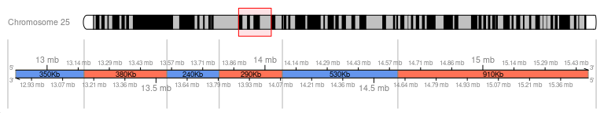

Note that the area is extended to the first and last TAD of the window.

Add insulation score (bedgraph), RNAseq (bigwig) and genomic annotations
to the graph:

``` r
TADplot(tad.gr = tad_domains.gr, chr = "chr19", start = 10.1e6, stop = 10.6e6,
        bedgraph = IS_HCT116_chr19_5kb.bedgraph, #dataframe, GRanges or path ("./IS.bedgraph")
        annot.gr = genomic.gr,
        annot.col = 3, #column number to group annotations
        bigwig.path = "./rna_seq_chr19_10.1to10.6mb.bw", 
        bigwig.yaxis = "log2" #log2 of RNAseq values
        )
```

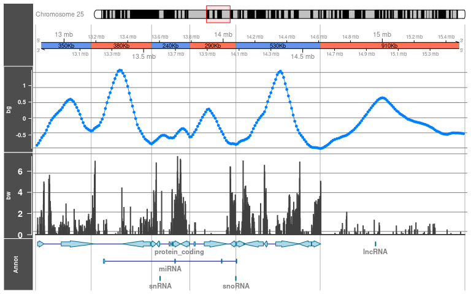

## 3.2 mTADplot

`mTADplot()` allow to plot 1 or more individual/sample in a same plot.
All tracks inputs must be stored in a list, and all object in the list
must have names:

To avoid having to load too much data in the R environment, we will see
how to use the paths of bedgraph files:

``` r
#write bedgraph as files
write.table(IS_HCT116_chr19_5kb.bedgraph, "./IS_HCT116_chr19_5kb.bedgraph1", col.names = FALSE, quote = FALSE, row.names = FALSE, sep = "\t") 

#create second bedgraph with a shift of 50kb
write.table(
  cbind(IS_HCT116_chr19_5kb.bedgraph[,1], IS_HCT116_chr19_5kb.bedgraph[,2:3] + 50e3, IS_HCT116_chr19_5kb.bedgraph[,4]),
  "./IS_HCT116_chr19_5kb.bedgraph2", col.names = FALSE, quote = FALSE, row.names = FALSE, sep = "\t") 
```

### 3.2.1 Create list

Let’s create lists for the 2 individuals (then named as “ind1” and
“ind2”):

- TADs:

``` r
#list of TADs
tad.lst = list(ind1 = tad_domains.gr, ind2 = shift(tad_domains.gr, 50e3))
```

- insulation scores:

``` r
#insulation score (path) list
IS.lst = list(ind1 = "./IS_HCT116_chr19_5kb.bedgraph1", ind2 = "./IS_HCT116_chr19_5kb.bedgraph2")
```

Do the plot:

``` r
mTADplot(tad.lst = tad.lst, chr = "chr19", start = 10e6, stop = 12e6,
        bedgraph.lst = IS.lst, bedgraph.name = "IS")
```

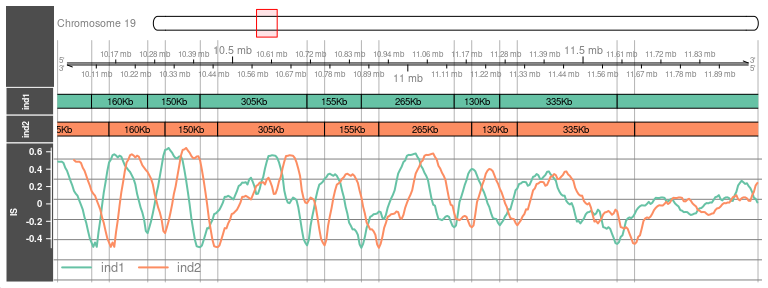

### 3.2.2 Create multiple lists

In case of several tracks of bedgraph, we can create a list containing
few other lists. Let’s create a list with PC1 scores for ind1:

``` r
#PC1 scores (granges) as list
PC1.lst = list(ind1 = PC1_250kb.gr)
```

Now let’s create a list with those 2 lists:

``` r
#multiple lists fo bedgraph
bedgraphs.lst = list(IS = IS.lst, PC1 = PC1.lst)
bedgraphs.lst
#> $IS
#> $IS$ind1
#> [1] "./IS_HCT116_chr19_5kb.bedgraph1"
#> 
#> $IS$ind2
#> [1] "./IS_HCT116_chr19_5kb.bedgraph2"
#> 
#> 
#> $PC1
#> $PC1$ind1
#> GRanges object with 10216 ranges and 1 metadata column:
#>           seqnames              ranges strand |      score
#>              <Rle>           <IRanges>  <Rle> |  <numeric>
#>       [1]     chr1     3750001-4000000      * | -0.0514171
#>       [2]     chr1     4000001-4250000      * | -0.4563361
#>       [3]     chr1     4250001-4500000      * | -0.4940089
#>       [4]     chr1     4500001-4750000      * | -0.4635031
#>       [5]     chr1     4750001-5000000      * | -0.4868202
#>       ...      ...                 ...    ... .        ...
#>   [10212]     chr9 132500001-132750000      * |   1.005161
#>   [10213]     chr9 132750001-133000000      * |   1.043409
#>   [10214]     chr9 133000001-133250000      * |   1.122094
#>   [10215]     chr9 134500001-134750000      * |   0.962972
#>   [10216]     chr9 135250001-135500000      * |   0.996128
#>   -------
#>   seqinfo: 22 sequences from an unspecified genome
```

Do the plot:

``` r
mTADplot(tad.lst = tad.lst, chr = "chr19", start = 10e6, stop = 12e6,
        bedgraph.lst = bedgraphs.lst)
```

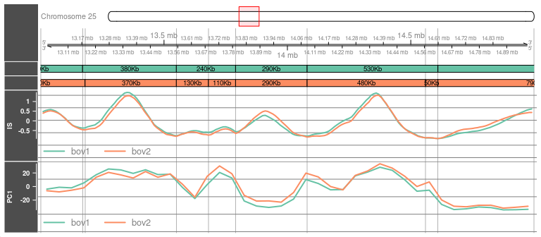

## 3.3 Options

When you master TADplot(), mTADplot() is much more powerful and flexible
to make the desired graphics. Moreover there are many options to change
some of the track parameters:

### 3.3.1 bigwigPath.lst

- bigwig.binsize: Bin sizes for the histogram. Default = 1e3.

- bigwig.xaxis: Function used to transform the x-axis among each
  bigwig.binsize. Defaults = “median”. Alternatively, other predefined
  functions can be supplied as character (“mean”, “median”, “sum”,
  “min”, “max” or “extreme”).

- bigwig.chr: Chromosome name used to filter chromosome names that can
  be different from chr (e.g chr = “1” and bigwig.chr = “chr1”). Default
  = NULL to used the same name as chr.

- bigwig.yaxis: Function used to transforming the y-axis values. Default
  = NULL. Use “log2” to use the function log2(x + 1) to transform the
  y-axis (for RNA seq) or provide any other function.

### 3.3.2 annotation.lst

- annot.col: Column number of the metadata from annot.gr file(s) used to
  group the annotation tracks. Default = NULL and the name of each
  annotation is added.

### 3.3.3 bedgraphPath.lst

- bedgraph.name: Name of the bedgraph track when there is only one track
  (default = “bedgraph”). Otherwise it takes the names of each list.

- bedgraph_outliers: Ratio to remove outliers of all each bedgraph
  values. Default is 0 (ie no filter). To remove the first and last 2
  percentiles (i.e extreme values / outliers) use 0.02.

# 4 Matrix plot

Two functions have been built to plot interaction count (HiC matrix) for
one matrix `MATplot()` and 2 matrices `mMATplot()` (on the upper or
lower part) as a ggplot graph. In addition to matrices, 3 others tracks
can be plotted:

- bed file type to visualized domains as lines or a triangles,
- bedpe file type to hightlight interactions between 2 areas (loops).

## 4.1 MATplot

### 4.1.1 matrix + triangles

Plot of the matrix at 50kb resolution with TADs as triangles on the
upper part of the matrix.

``` r
MATplot(matrix = mat_HCT116_chr19_50kb, start = 5e6, stop = 15e6,
        bin.width = 50e3, log2 = T,
        tad.upper.tri = tad_domains.gr,
        tad.chr = "chr19", #filter TADs for chr 19
        scale.colors = "H", #color of matrix, try "D" or "H"
        annotations.color = "red")+
  ggtitle("log2(raw count): chr19 human HCT116")
#> Warning: Removed 1 rows containing missing values (`geom_segment()`).
#> Removed 1 rows containing missing values (`geom_segment()`).
```

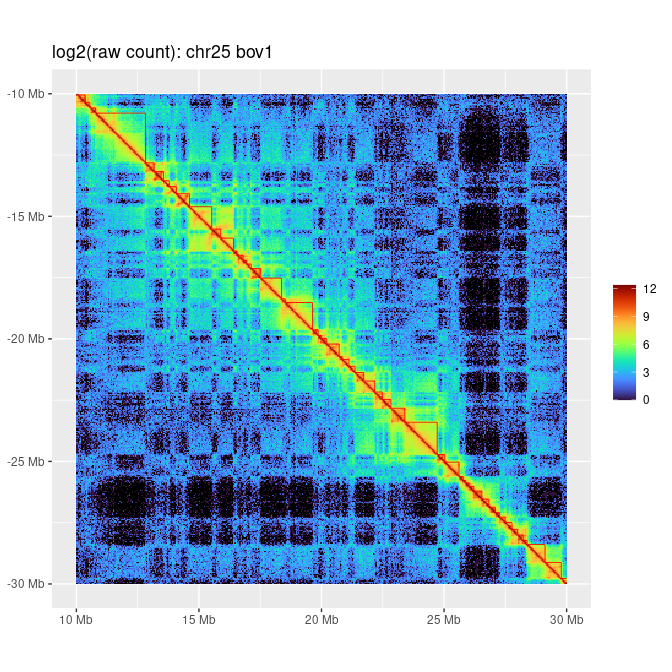

### 4.1.2 matrix + triangles + loops + lines

bedpe file are used to highlight 2 areas. For example let’s create a
bedpe file to highlight a region on chromosome 19 between :

- 9.1Mb to 9.8Mb,
- 11.6Mb to 12.7Mb:

``` r
bedpe = data.frame(chr1 = "chr19", start2 = 9.1e6, end2 = 9.8e6,
                   chr2 = "chr19", start1 = 11.6e6, end1 = 12.7e6)
bedpe
#>    chr1  start2    end2  chr2   start1     end1
#> 1 chr19 9100000 9800000 chr19 11600000 12700000
```

In addition to bedpe file, let’s see 2 others functions:

- `matObsExp()` to produce the observed / expected ratio of interaction
  counts,
- `PC1calling()` to call the compartments A and B from PC1 values.

``` r
MATplot(matrix = matObsExp(mat_HCT116_chr19_50kb), 
        start = 5e6, stop = 15e6,
        bin.width = 50e3, log2 = T,
        tad.upper.tri = tad_domains.gr,
        tad.chr = "chr19", #filter TADs for chr 25
        scale.colors = "OE", 
        annotations.color = "red",
        loop.bedpe = bedpe,
        tad.upper.line = PC1calling(PC1_250kb.gr), #compartments
        tad.line.col = 1 #use the fist metadata columns with factors A or B
        )+
  ggtitle("log2(obs/exp): chr19 human HCT116")
#> Warning: Removed 1 rows containing missing values (`geom_segment()`).
#> Removed 1 rows containing missing values (`geom_segment()`).
```

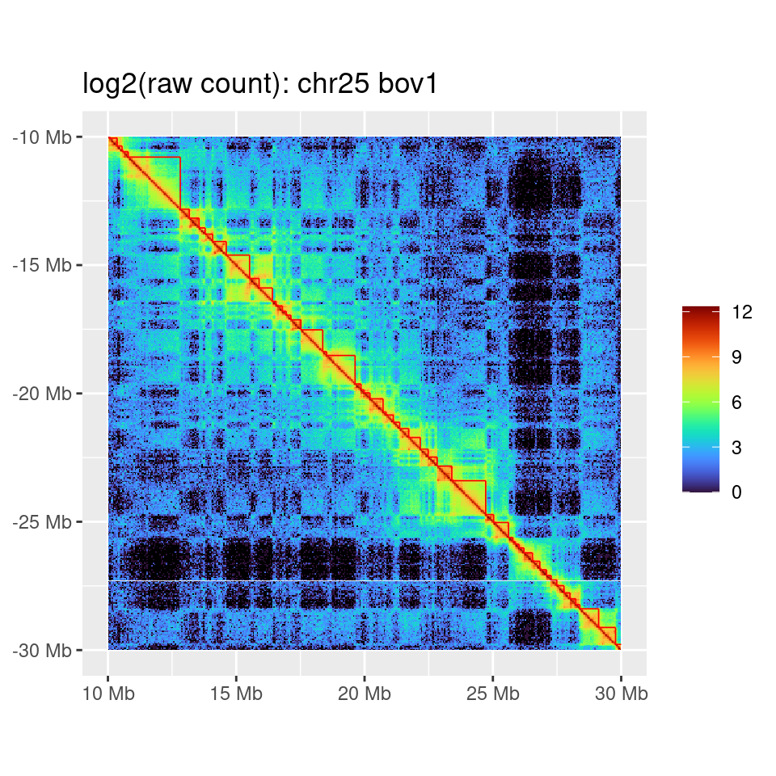

## 4.2 mMATplot

### 4.2.1 2 matrices + triangles

Like `MATplot()`, `mMATplot()` allow to plot 2 matrices: one on the
upper part of the plot and the other one on the lower part. Let’s plot
the 2 matrices and TADs for ind1 and compartments for ind2:

``` r
mMATplot(matrix.upper = mat_HCT116_chr19_50kb,
         matrix.lower = mat_HCT116_chr19_50kb,
         matrix.upper.txt = "ind1",
         matrix.lower.txt = "ind2",
         start = 5e6, stop = 15e6,
         bin.width = 50e3, log2 = T,
         tad.upper.tri = tad_domains.gr,
         tad.lower.tri = PC1calling(PC1_250kb.gr),
         tad.chr = "chr19")+
  ggtitle("log2(raw count): chr19 ind1 vs ind2")
#> Warning: Removed 1 rows containing missing values (`geom_segment()`).
#> Removed 1 rows containing missing values (`geom_segment()`).
#> Removed 1 rows containing missing values (`geom_segment()`).
```

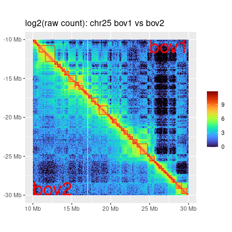

# 5 Distribution of features related to domains

Two distinct approaches allow to analyzed and visualized distributions
of any annotation features (e.g. genes) according to the domains:

Thus, the distribution of features can be analyzed:

- on both sides of TAD boundaries (i.e. around boudaries),
- or within TADs (i.e. between TAD starts and ends).

## 5.1 Around boundaries

Suppose we want to analyze the distribution of genes around the TAD
boundaries. We can either analyze the gene coverage (i.e gene density)
or the distribution of the genes features (i.e start or stop of the
genes). These analyses are done in two steps. The first is to use the
`boundArea()` to return all the genes that are around each TAD boundary
in a specific window. It is possible to analyze the distribution of
genes features around TAD starts, TAD ends or even the center of TADs.

Let’s analyzed genes around TAD starts +/- 50kb.

``` r
#filter protein coding genes
genes.gr = genomic.gr[as.character(genomic.gr$gene_biotype) == "protein_coding"]

data.gr = boundArea(domain.gr = tad_domains.gr, annot.gr = genes.gr,
                  window.size = 50e3, 
                  domain.boundary = "start")
```

### 5.1.1 Coverage

``` r
areaCov(data.gr)
```

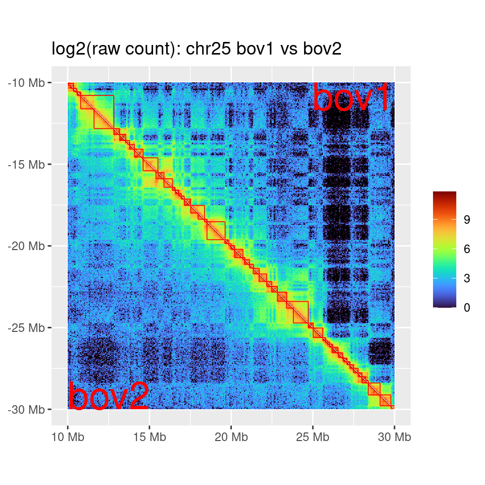 The
`areaCov()`function return the graph with the gene coverage on a sliding
window of 5kb. As the cumulative size of genes are different according
to the strands:

``` r
genes.gr %>% as.data.frame() %>% group_by(strand) %>% summarise(sum = sum(width))
#> # A tibble: 2 × 2
#>   strand       sum
#>   <fct>      <int>
#> 1 +      660437624
#> 2 -      623588745
```

We can normalized the coverage between strands with the Z-score and
observe a symmetrical coverage of the genes according to their strands:

``` r
areaCov(data.gr, norm = TRUE)
```

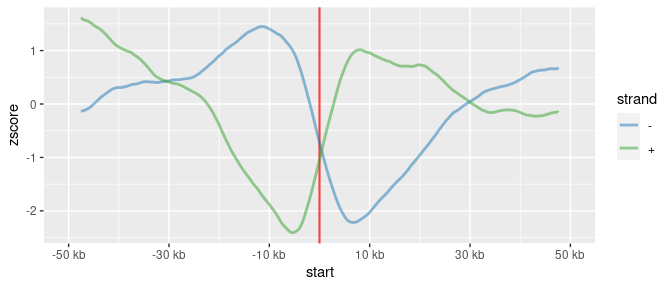

### 5.1.2 Distribution

Let’s now look at the distribution of the genes starts (TSS) around the
TAD boundaries:

``` r
areaHist(data.gr,
         annot.boundary = "start",
         annot.strand = FALSE,
         bin.width = 5e3)
#> Warning: Removed 215 rows containing non-finite values (`stat_bin()`).
```

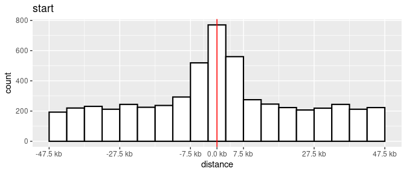

This time, we have defined the size of the bins at 5kb which corresponds
to the resolution of the insulation score used to call the TADs. What we
observe is an increase of the TSS in the bin of the borders.

## 5.2 Within domains

### 5.2.1 Distribution

Let’s do the same analysis (TSS distribution) but this time within the
domains (i.e relative position of the TSS according to the TADs).

``` r
domainHist(domain.gr = tad_domains.gr, annot.gr = genes.gr,
        annot.boundary = "start",
        ifoverlap = "remove", #parameter discuss later
        annot.strand = FALSE #don't split forward / reverse strand
        )
#> 685/19025 annotations are outside domains
#> 2278/19025 annotations are overlapping with a boundary
#> 16062/19025 annotations are within domains and do not overlap a boundary
```

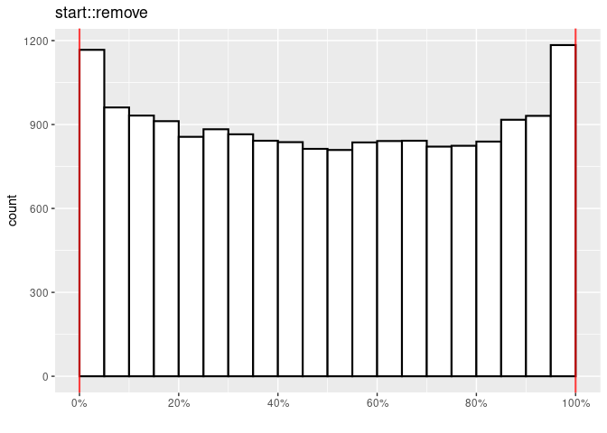

As before, we observe an increase in TSS near the TAD borders. In the
message return by `domainHist()` we also observe that 2278 genes overlap
a boundary. In the example above, these genes were not taken into
account (`ifoverlap = "remove"`).

To illustrate the two other available options for considering these
genes, let’s create an illustration:

``` r
#create 1 genes
annot.gr <- dataframes2grange(
  data.frame(chr = 1, start = 198e3, end = 290e3, strand = "+", names = "gene"),
  data.frame(chr = "1", size = 400e3),
  strand.col = 4,
  name.col = 5)

#Create 2 TADs
tad.gr <- dataframes2grange(
  data.frame(chr = 1, start = c(100e3, 200e3), end = c(200e3, 300e3)),
  data.frame(chr = "1", size = 400e3))

#plot
plot = TADplot(tad.gr = tad.gr, annot.gr = annot.gr, start = 150e3, stop = 300e3, chr = 1)
```

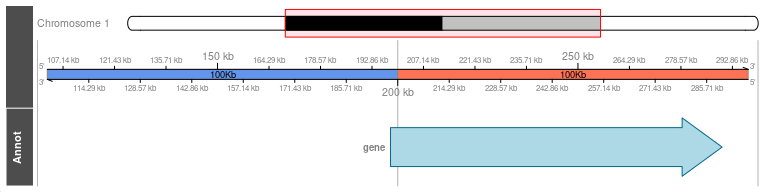

We can now take the overlapping genes into account in 2 different ways:
The first one is to take the real position of the TSS (i.e at the end of
the first TAD in our example):

``` r
domainHist(domain.gr = tad_domains.gr, annot.gr = genes.gr,
        annot.boundary = "start",
        ifoverlap = "real", 
        annot.strand = T)
#> 685/19025 annotations are outside domains
#> 2278/19025 annotations are overlapping with a boundary
#> 16062/19025 annotations are within domains and do not overlap a boundary
#> Warning: Removed 4 rows containing missing values (`geom_path()`).
```

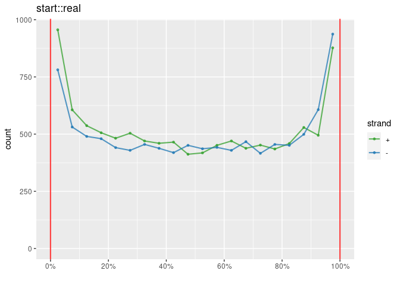

We observe the same distribution independently of their respective
strands.

Now if we add the uncertainty of the position of the TAD boundaries
(i.e. the size of the bins) to our illustration:

``` r
#add an annotations to represent the size on the boundary (bin size)
annot.gr <- dataframes2grange(
  data.frame(chr = 1, start = c(198e3,197.5e3), end = c(290e3, 202.5e3), strand = c("+", "*"), names = c("gene", "boundary")),
  data.frame(chr = "1", size = 400e3),
  strand.col = 4,
  name.col = 5
)

#plot
plot = TADplot(tad.gr = tad.gr, annot.gr = annot.gr, start = 150e3, stop = 300e3, chr = 1)
```

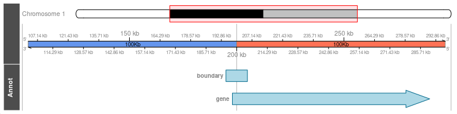

Instead of taking the actual position of the TSS (i.e. at the end of the
first TAD) one can ask in which TAD is this gene most likely located?
This is it, in the second TAD. Thus the position of the TSS is measured
in relation to the TAD where it is most likely located (i.e few kilo
bases before the second TAD). If we restart `domainHist()` by taking the
best match of the genes that overlap the boundaries, we observe that the
genes are oriented preferentially towards the center of the TADs.

``` r
domainHist(domain.gr = tad_domains.gr, annot.gr = genes.gr,
        annot.boundary = "start",
        ifoverlap = "best", 
        annot.strand = T)
#> 685/19025 annotations are outside domains
#> 2278/19025 annotations are overlapping with a boundary
#> 16062/19025 annotations are within domains and do not overlap a boundary
#> Warning: Removed 292 rows containing non-finite values (`stat_bin()`).
#> Removed 292 rows containing non-finite values (`stat_bin()`).
#> Warning: Removed 4 rows containing missing values (`geom_path()`).
```

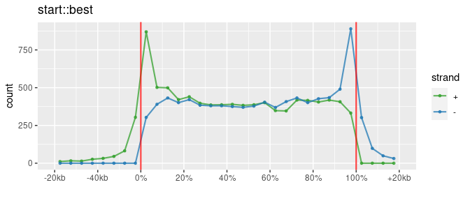

To check for methodological bias, let’s randomize the 3D organization
and check if it loses this orientation of the genes. To do that we will
used `TADshuffling()` to shuffled juxtaposition of TADs.

``` r
domainHist(domain.gr = TADshuffling(tad_domains.gr), annot.gr = genes.gr,
        annot.boundary = "start",
        ifoverlap = "best", 
        annot.strand = T)
#> 685/19025 annotations are outside domains
#> 1858/19025 annotations are overlapping with a boundary
#> 16482/19025 annotations are within domains and do not overlap a boundary
#> Warning: Removed 348 rows containing non-finite values (`stat_bin()`).
#> Removed 348 rows containing non-finite values (`stat_bin()`).
#> Warning: Removed 4 rows containing missing values (`geom_path()`).
```

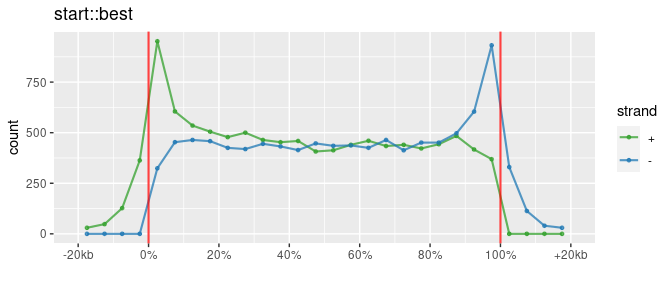

### 5.2.2 Coverage

Instead of analyzing the distribution of the TSS within TADs, it is
possible to measure gene density of each bin and plot the smoothed gene
density within TADs:

``` r
domainCov(domain.gr = tad_domains.gr, annot.gr = genes.gr,
           bin.width = 5e3,
           annot.col = "strand", norm = TRUE)
#> `geom_smooth()` using method = 'gam' and formula = 'y ~ s(x, bs = "cs")'
```

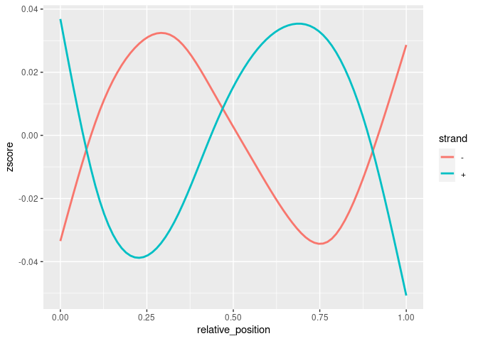
Again, we observed a symmetrical genes coverage according to their
strands. We also observe a high gene density on the forward strand at
the beginning of TADs and inversely for the reverse strand.

This analysis can also be done by domain class, for example between
compartments A and B:

``` r
comp.gr = PC1calling(PC1_250kb.gr) #call compartment A or B from PC1 values

domainCov(domain.gr = comp.gr, annot.gr = genes.gr,
           domain.col = 1,
           bin.width = 50e3, norm = TRUE)
#> `geom_smooth()` using method = 'gam' and formula = 'y ~ s(x, bs = "cs")'
```

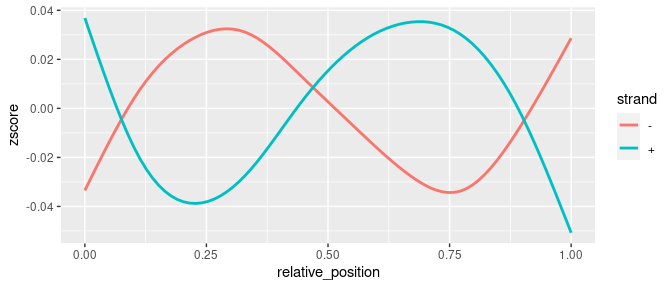

As expected the gene density is higher in compartment A (active
compartments) than B.

# 6 Matrix pattern surrounding features

A function allows the quantification and visualization of patterns (of
the matrix) surrounding genomic features.

To illustrate, let’s visualized the stacking of the matrices at the TSS
(+/- 1Mb) on chromosome 25:

``` r
MATfeatures(matrix = mat_HCT116_chr19_50kb, bin.width = 50e3, annot.gr = genes.gr, chr = "chr19", annot.boundary = "start", window.size = 1e6, output = "plot")
#> Staking of 1388 matrices on chr chr19.
#> 'as(<dtCMatrix>, "dgCMatrix")' is deprecated.
#> Use 'as(., "generalMatrix")' instead.
#> See help("Deprecated") and help("Matrix-deprecated").
```

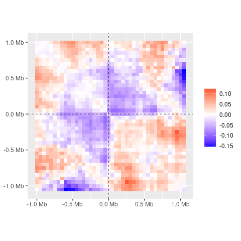

From the TSS, this matrix plot is created in few steps:

- extract matrices around TSS (+/- 1Mb),
- stack all the matrices (sum of all matrices),
- calculate the ratio of observed / expected values with `matObsExp`
  function,
- plot the log2.

It is also possible to plot the matrices at TAD starts:

``` r
MATfeatures(matrix = mat_HCT116_chr19_50kb, bin.width = 50e3, annot.gr = tad_domains.gr, chr = "chr19", annot.boundary = "start", window.size = 1e6, output = "plot")
#> Staking of 146 matrices on chr chr19.
```

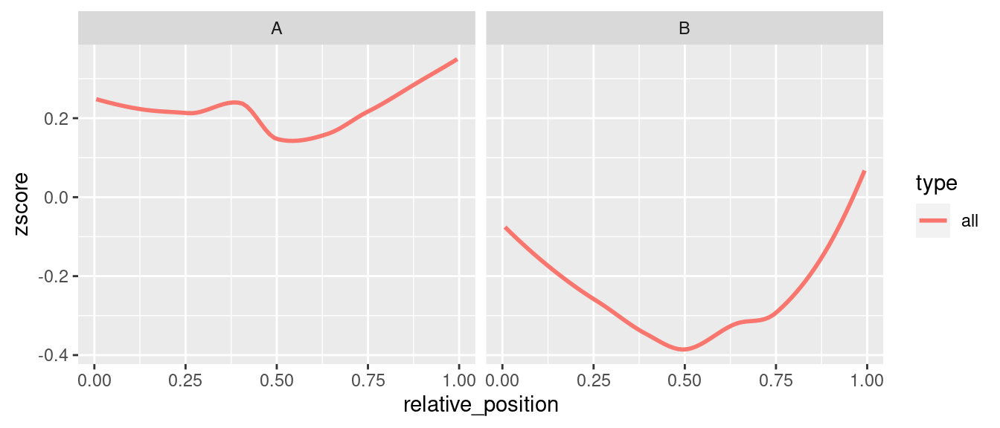

# 7 Compartment calling and orientation

Algorithms has develop to perform principal component analysis on HiC
matrices which allows to identify compartments A or B. The orientation
of the principal component scores are random and then can be oriented
using gene density or GC percent between compartments A and B. In this
package `PC1calling()` allows to call the compartments from the
princiapl component scores (PC1) and `compOrientation()` allows to
orient these values according to gene expressions.

To do so, we will use the package “airway” which gives read counts of
the genes from an RNA-Seq experiment in human airway smooth muscle cell
lines. Although the cell line has little to do with the HiC data used,
the 3D organization is sufficiently consistent between cell types to
check proper orientation of compartments.

``` r
#BiocManager::install("airway")
library("airway")
#> Loading required package: SummarizedExperiment
#> Loading required package: MatrixGenerics
#> Loading required package: matrixStats
#> 
#> Attaching package: 'matrixStats'
#> The following objects are masked from 'package:Biobase':
#> 
#>     anyMissing, rowMedians
#> The following object is masked from 'package:dplyr':
#> 
#>     count
#> 
#> Attaching package: 'MatrixGenerics'
#> The following objects are masked from 'package:matrixStats':
#> 
#>     colAlls, colAnyNAs, colAnys, colAvgsPerRowSet, colCollapse,
#>     colCounts, colCummaxs, colCummins, colCumprods, colCumsums,
#>     colDiffs, colIQRDiffs, colIQRs, colLogSumExps, colMadDiffs,
#>     colMads, colMaxs, colMeans2, colMedians, colMins, colOrderStats,
#>     colProds, colQuantiles, colRanges, colRanks, colSdDiffs, colSds,
#>     colSums2, colTabulates, colVarDiffs, colVars, colWeightedMads,
#>     colWeightedMeans, colWeightedMedians, colWeightedSds,
#>     colWeightedVars, rowAlls, rowAnyNAs, rowAnys, rowAvgsPerColSet,
#>     rowCollapse, rowCounts, rowCummaxs, rowCummins, rowCumprods,
#>     rowCumsums, rowDiffs, rowIQRDiffs, rowIQRs, rowLogSumExps,
#>     rowMadDiffs, rowMads, rowMaxs, rowMeans2, rowMedians, rowMins,
#>     rowOrderStats, rowProds, rowQuantiles, rowRanges, rowRanks,
#>     rowSdDiffs, rowSds, rowSums2, rowTabulates, rowVarDiffs, rowVars,
#>     rowWeightedMads, rowWeightedMeans, rowWeightedMedians,
#>     rowWeightedSds, rowWeightedVars
#> The following object is masked from 'package:Biobase':
#> 
#>     rowMedians
data(airway)
count = assay(airway, "counts")[, 1]

expression.data.frame = data.frame(ID = names(count),
                                   Name = names(count),
                                   count = count)

head(expression.data.frame)
#>                              ID            Name count
#> ENSG00000000003 ENSG00000000003 ENSG00000000003   679
#> ENSG00000000005 ENSG00000000005 ENSG00000000005     0
#> ENSG00000000419 ENSG00000000419 ENSG00000000419   467
#> ENSG00000000457 ENSG00000000457 ENSG00000000457   260
#> ENSG00000000460 ENSG00000000460 ENSG00000000460    60
#> ENSG00000000938 ENSG00000000938 ENSG00000000938     0
```

Now, knowing that A compartments are more active than B compartments, we
can use `compOrientation()` to:

- call A and B compartments,
- calculate median expression,
- invert PC1 values for chromosomes with expression rate of B \> A.

``` r
data = compOrientation(bedgraph.gr = PC1_250kb.gr, annot.gr = genes.gr, expression.data.frame = expression.data.frame)
#> 560/19025 annotations are outside domains
#> 581/19025 annotations are overlapping with a boundary
#> 17884/19025 annotations are within domains and do not overlap a boundary
#> 17445/17884 annotations have data expression
#> 0/22 chromosomes have been reversed
```

We can compare the expression level between compartments before
orientation:

``` r
ggplot(data$expression, aes(y = log2(exp + 1), fill = comp))+geom_boxplot()+facet_wrap(.~chr)
```

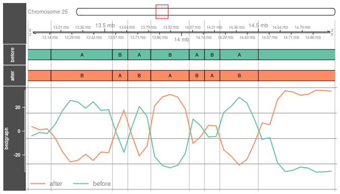

The median expression level is always higher in the A compartments, PC1
values are therefore correctly oriented.

# 8 Clear files

``` r
file.remove(list.files(full.names = TRUE, pattern = ".bw"))
#> [1] TRUE
file.remove(list.files(full.names = TRUE, pattern = ".bedgraph"))
#> [1] TRUE TRUE TRUE
file.remove(list.files(full.names = TRUE, pattern = ".df"))
#> [1] TRUE
```
